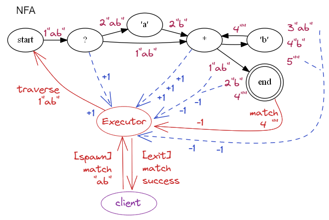

# myrex - MY Regular Expressions in eliXir

An Elixir library for matching strings against regular expressions (REGEX).

The implementation is based on the idea of _Process Oriented Programming:_ 
* Algorithms are implemented using a fine-grain directed graph of 
  independent share-nothing processes.
* Processes communicate asynchronously by passing messages. 
* Process networks naturally run in parallel.

The REGEX is converted to an _Abstract Syntax Tree_ (AST)
using a variation of the _Shunting Yard_ parsing algorithm
\[[Wikipedia](https://en.wikipedia.org/wiki/Shunting_yard_algorithm)\].

The AST is used to build a _Non-deterministic Finite Automaton_ (NFA)
using a variation of _Thompson's Algorithm_
\[[Wikipedia](https://en.wikipedia.org/wiki/Thompson%27s_construction)\]
\[[Cox](https://swtch.com/~rsc/regexp/regexp1.html)\].

The NFA is executed directly by propagating messages through the network.

The process network is a directed graph that will contain cycles
to implement quantified repetition.
Quantifiers and alternate choices are implemented
by individual processes of the NFA having 2 or more output edges.
Traversals are duplicated by sending messages 
along _all_ these outgoing edges at once.

All possible traversals are explored in parallel.
Processes implementing rules that do not match the input 
cause the traversal to terminate. A traversal that reaches the 
final process returns a successful match of the input.

The runtime execution of the process network depends on
the Erlang BEAM scheduler being _fair,_
which means that all active traversals will make some
incremental progress until a successful match is found.
The scheduler will ensure that a single exponentially long
failed match does not starve other traversals.
However, this also means it cannot guarantee the efficient 
dedicated execution of an exponentially long successful match.

## Features

A simple regular expression processor.

Standard syntax:
* `c` literal char _c_
* `\` escape character (see below)
* `.` any character
* `|` alternate choice
* `?` zero or one 
* `+` one or  more
* `*` zero or more
* `{n}` exactly _n_ repeats
* `(` begin group with implicit capture
* `(?:` begin group without capture
* `(?<name>` begin group with named capture
* `)` end  group
* `[`  begin character class
* `[^`  begin negated character class
* `]`  end character class
* `-`  character range

Compile a REGEX into an NFA:
  * Lexical processing of the REGEX to a token sequence.
  * Parse the tokens into an AST.
  * Traverse the AST to build an NFA process network.

Matching an input string against a REGEX:
  * Launch an execution manager process.
  * (Optionally) build the NFA network.
  * Inject a traversal message into the NFA network.
  * Monitor execution of the network.
  * Receive result or recognize the end of all traversals.
  * (Optionally) tear down the NFA network.
  * Report the result and halt the manager process.

Two execution patterns:
* Batch - single network processes multiple input strings simultaneously.
* Oneshot - dedicated independent network is built and torn down for each input. 

Two traversal strategies for ambiguous matches:
* One - return the first match and halt execution.
* All - wait for all traversals to complete,
  return all captures for ambiguous matches.
  
Simple public interface in `Myrex` module:
* Batch - `compile` and `teardown`
* Execution - `match` and `search`

Binary Data:
* Strings are processed as UTF-8 binaries
  \[[Erlang](https://www.erlang.org/doc/efficiency_guide/binaryhandling.html)\],
  not converted to character lists.
* Short input strings (< 64B) are copied between processes.
* Large input strings (>=64B) are kept as a single copy,
  with all processes using references into shared heap memory.

Utility to generate diagrams of NFA process networks
in [GraphViz](https://www.graphviz.org) DOT format
and convert them to PNG images.

### Captures

A _group_ in the REGEX is delimited by brackets: `(...)`. 
When an input string is successfully matched, 
the fragment matching the group is stored as a _capture._
The set of all captures is returned as a map of name keys
to capture values. 

Unlabelled groups `(`...`)` are implicitly named with 1-based integers
based on the order of the opening `(` in the REGEX.

Groups can be explicitly labelled with strings
using the syntax `(?<name>`....`)`. 
Labelled groups also get the implied integer name,
so the result may contain the same capture value
referenced by both label and number keys.

Groups can be forced to be non-capturing
using the syntax `(?:`...`.)`.

The 0 capture key always refers to the whole input string.

Capture values can be represented in two ways:
* Integer `{position, length}` reference into the input string.
* The actual substring (binary) matched by the group.

Processing of captures for a successful result
is controlled by the `:capture` and `:return` options (see below).

### Escapes

Elixir escapes - a single backslash in a `String` literal 
converts the following character(s) to a unicode codepoint:
* `\c` literal escape for space or non-printable character.
* `\xHH` 2-digit hex character value.
* `\uHHHH` 4-digit hex unicode value.

Myrex escapes - a double backslash `\\` in an Elixir `String`
passes a single backslash `\` to `Myrex`, 
which uses it to escape the following 
character(s):
* `\\c` escaped backslash for non-printable or special character _c,_
  except for generic character class escapes listed below (`d`,`D`,`w`,`W`, ...).
* `\\xHH` 2-digit hex character value.
* `\\uHHHH` 4-digit hex unicode value.
* `\\p{prop}` and `\\P{prop}` (negated): 
  Character classes for Unicode _properties_ (blocks, categories \[[Wikipedia](https://en.wikipedia.org/wiki/Unicode_character_property#General_Category)\], scripts).
  Includes extension categories: 
  * `Xan` alphanumeric: combine letter `L` or `N` number categories.
  * `Xsp` whitespace: separator `Z` category or `\f`, `\n`, `\t`, `\r`, `\v`.
  * `Xwd` word character: letter `L` or `N` number or underscore `'_'`.
* Generic escapes:
  * `\\d`, `\\D` (negated): number digit character class,
    converted to unicode category `Nd`.
  * `\\s`, `\\S` (negated): whitespace character class, 
    converted to extension category `Xsp`.
    Note this is not just the literal escape `\s` for space U+0020.
  * `\\w`, `\\W` (negated): word character class, 
  converted to extension category `Xwd`.

## NFA Design

A process network is a directed graph that has processes for nodes
and message pathways as edges.
A process subgraph has a single input edge and one or more output edges.
The subgraph may be a single process that has both an input and 
one or more outputs.

The semantics of the process network is slightly different to the
traditional definition of an NFA. 

In an NFA, the nodes are _states_ and the edges are _labelled_ transitions.
The node passively receives a transition, 
then makes the decision to traverse zero (no match), one or more _outgoing_ edges, 
based on the match of the edge label to the next input character.

In a process network, the nodes are either _labelled_ matching processes
or traversal control processes. Network edges carry traversal _state_ messages.
A node matches or transforms incoming messages with the node rule.
If there is a successful match, 
the traversal continues through _all_ outgoing edges. 
If there a match is unsuccessful, a termination _no match_ 
message is sent to the manager process.

### Traversals

A traversal is a sequence of 
messages that propagates through the network.

An input string is injected as a message into the `Start` input node 
of the process network.  
Each traversal continues until it fails to match,
or reaches the final `Success` output node.

Multiple traversals propagate concurrently within the network.
An ambiguous regular expression may match an input string in multiple ways,
which means that mutiple traversals may reach the `Success` node.

The progress of each traversal depends on the 
Erlang BEAM scheduler. The behaviour appears 
to be non-deterministic from an outside point of view,
but can be made repeatable by running with 
the same random number generator seed.

Multiple input strings can have concurrent active traversals.
All matching state is maintained in the messages, 
not in the nodes, and there is no globally accessible state.

Each message contains the traversal state for the match:
* A copy or reference to the input string.
* The current position in the string.
* The current state for groups:
  * Previous capture results.
  * Stack of currently open groups.
* A client process return address for the result.

### Combinators

The NFA is built using a variation of Thompson's Algorithm 
based on process _combinators._
A combinator is a function that takes one or more process subgraphs
and combines them into a single larger graph.
Process combinators correspond to AST branch nodes.
Combinators recursively build larger networks
from smaller operator subgraphs, 
grounded in atomic character matchers
\[[Cox](https://swtch.com/~rsc/regexp/regexp1.html)\].

There are 6 processes used by combinators
to implement parts of the AST as process subgraphs:
* Branch nodes (quantifiers and alternate choice) 
  use `Split` to clone (fan out) traversals 
  across 2 or more downstream subgraphs.
* Groups use `BeginGroup` and `EndGroup` to record captures.
* Negated character classes use `BeginPeek` and `EndPeek` to 
  advance the input after a sequence of peek lookahead matches.
* Leaf nodes use `Match` with an _acceptor_ function
  to do the actual matching of individual characters, 
  character ranges and character properties.
  
#### Sequence and Group

Combinator for a sequence of process networks `P1 P2 .. Pn`:

```
       +----+             +----+
in --->| P1 |---> ... --->| Pn | ---> outputs
       +----+             +----+
```
Combinator for a group capture around a sequence `(P1 P2 .. Pn)`:

```
       +-----+    +----+             +----+    +-----+
in --->|Begin|--->| P1 |---> ... --->| Pn |--->| End |---> out
       |Group|    +----+             +----+    |Group|
       +-----+                                 +-----+
```
  Example for REGEX `"(ab)"`, where the 
  `BeginGroup` and `EndGroup` are labelled with `(` and `)`.
  
  .png)

 Combinator for an AND NOT sequence of peek lookahead 
 matching nodes  `M1 M2 .. Mn`.
 The peeking nodes are created in a negated character class,
 where all negative tests must pass for the first character of input,
 but the character is not consumed. 
 At the end of the sequence, when all matches have passed,
 the character is consumed from input.

  ```
          +-----+    +--+             +--+    +----+
   in --->|Begin|--->|M1|---> ... --->|Mn|--->|End |---> out
          |Peek |    +--+             +--+    |Peek|
          +-----+                             +----+
  ```
  Example for REGEX `[^0-9p]`, where 
  `BeginPeek` and `EndPeek` are labelled with `[^` and `^]`.
  
  
  
#### Alternate Choice

Combinator for fan-out of alternate matches `P1 | P2 | .. | Pn`
with `Split` process _S_ :

```
                 +----+
                _| P1 |---> outputs
               / +----+
              /
        +---+/   +----+
 in --->| S |--->| P2 |---> outputs
        +---+\   +----+
              \    :   ---> outputs
               \ +----+
                -| Pn |---> outputs
                 +----+
```
  Example for REGEX `a|b|c|d`, where the `Split` node 
  for alternate choice is labelled with `|`.
  
  
  

Character classes `[...]` are implemented as alternate choices
for all the enclosed characters, character ranges and character properties.

  Example for REGEX `[a-dZ]`, where the `Split` node 
  for a positive character class is labelled with `[]`.
  
  
  
Combined example of a choice between two groups with REGEX `(ab)|(cd)`:
  
  _vbar_(cd).png)

#### Quantifiers

Combinator for _zero or one_ repetitions `P?`.

`Split` node _S_ can bypass the process subgraph _P_ (zero).

```
        +---+
        | P |---> outputs
        +---+
          ^ 
          | 
        +---+
 in --->| S |---> output
        +---+
```

  Example for REGEX `t?`, where the `Split` node 
  for the zero-or-one quantifier is labelled with `?`.
  
  

Combinator for _one or more_ repetitions `P+`. 

`Split` node _S_ can cycle back to the process node _P_ (more).
The new network only has one output from the split node.

```
        +---+
 in --->| P |
        +---+
         ^ |
         | V
        +---+
        | S |---> output
        +---+
```
  Example for REGEX `j+`, where the `Split` node 
  for the one-or-more quantifier is labelled with `+`.
  
  
  
  
Combinator for _zero or more_ repetitions `P*`.

`Split` node _S_ can cycle through the process node _P_ (more).
The split node can bypass the process subgraph _P_ (zero).
The new network only has one output from the split node.

```
        +---+
        | P |
        +---+
         ^ |
         | V
        +---+
 in --->| S |---> output
        +---+
```
  Example for REGEX `m*`, where the `Split` node 
  for zero-or-more quantifier is labelled with `*`.
  
  
  
### Interface Processes
  
There are 2 process used for the 
overall input and output of the NFA process network:
* `Start` - the initial process where strings are injected for matching.
* `Success` - the final process where successful matches are emitted.

The `Start` process also implements construction of the NFA
by spawning and connecting child processes. 
The child processes are _linked_ to the `Start` process,
so the whole network can be torn down after use, or on error.

The `Success` node is labelled with `end` in the NFA graph diagrams.

The process network has a lifecycle based on _batch_ or _oneshot_ patterns.

### Execution Process

The matching of individual input strings is managed by a 
transient `Executor` process instance.
An `Executor` is created for each input string 
and exits when the matching process completes.  

The `Executor` passes the input string to the `Start` process,
monitors the number of active traversals, 
receives notification of failed matches,
and gets zero or more successful match results from the `Success` process.
The `Executor` exits after the result is returned to the calling client.

A _oneshot_ `Executor` builds a private NFA process network,
manages execution for the input string, 
and tears down the network at the end of the match.

A _batch_ `Executor` just re-uses an existing NFA process network
and does not tear the network down at the end. 

Note that in Elixir (Erlang) sending a message to a non-existent
process is a silent no-op, not an error, so nodes in a batch NFA
may continue traversals even after the `Executor` has halted
with a successful result. 

### `Executor` Example

Consider matching the string `"ab"` 
against the regular expression `a?b*`.

 

The client invokes the match and spawns the `Executor` process. 
The `Executor` fires the input string `1"ab"` into the `Start` process 
(the message is labelled with id `1` to help the explanation).
The `Executor` keeps a count of `1` existing traversal.

`Start` forwards the input to the `?` Split node, 
which makes a copy labelled with id `2`,
notifies the `Executor` of the extra copy, 
and sends `1"ab"` and `2"ab"` to its outputs. 

The `a` node successfully matches the first character of input,
removes the `a` from the input, then sends a new traversal 
with `2"b"` to its output. 

The `*` Split node receives `1"ab"`, duplicates it to make `3"ab"`
and sends them to its outputs.
The `*` node receives `2"b"`, duplicates it to make `4"b"`
and sends them to its outputs.
The `Executor` is notified of each copy to increment the total count.

The Success `end` node receives `1"ab"` and `2"b"`, 
but these are not all consumed, so it notifies the `Executor`
to decrement the total count for failed matches.

The `b` node receives `3"ab"`, but it does not match `b`,
so it notifies the `Executor` to decrement the total count for a failed match.
Then it receives `4"b"`, which successfully matches `b`, 
so it removes the `b` from the input, and sends a new traversal with `4""` 
to its output. 

The `*` node receives `4""`, duplicates it to make `5""`
sends them to its outputs, and notifies the `Executor` of the extra traversal.
The `b` node receives the empty string, which does not match,
so it notifies the `Executor` to decrement the total count for a failed match.

The Success `end` node receives `4""`, which is the empty string,
so it notifies the `Executor` of a complete successful match.
The `Executor` reports a match result and terminates.

Of course, the execution is concurrent and non-deterministic, 
so the sequence of messages does not necessarily happen in the order described.
It is possible that the successful match is recognized early,
and the NFA is torn down before all the traversal messages 
have finished propagating ( _oneshot_ mode ). 

## Multiple Matches

Some regular expressions are ambiguous and 
may have multiple possible captures for a successful match.

The outcome for ambiguous expressions is usually 
determined by the operators being _greedy_ or _non-greedy._
The Myrex implementation has local atomic operators 
that execute in parallel as an NFA, so they cannot choose 
_greedy_ or _non-greedy_ behaviour.

For example, the string `aa` matches the regex `(a?)(a?)(a*)(a*)` in 8 different ways.
A _greedy_ sequential algorithm will always capture `"a","a","",""`.
A _non-greedy_ sequential algorithm will always capture `"","","","aa"`.
A parallel algorithm that finds all matches will return 8 different 
sets of captures.

### Multiplicity Option

There is an option to choose how multiple matches are handled:
* _One_ - stop at the first successful match and return the capture.
  If it is a oneshot execution, then teardown the NFA process network.
  If it is a batch execution, then just halt the `Executor` process.
* _All_ - wait for all traversals to complete and return all possible captures.

The _One_ match is non-deterministic - the clue is in the name _*N*_ FA :)
The match is not necessarily the first in order in the input string,
it is just the first successful traversal to complete execution.
The actual outcome depends on the Erlang BEAM scheduler.

If the regular expression is not ambiguous, 
then the option should always be set to _one,_
because there may be a long delay to wait for 
all failure traversals to finish.

### Ambiguous Example

Let the exponential meta-operator `^` mean repetition
of characters and groups in a string.
So `a^4` for a string means `aaaa` 
and `(a?)^4` for a regex means `(a?)(a?)(a?)(a?)`.
We will consider a regex of the form `(a?)^n (a*)^n` 
matching a string of `a^n`
(a highly ambiguous exaggeration from the example in
\[[Cox](https://swtch.com/~rsc/regexp/regexp1.html)\]).

The no. of matches, _S(n),_ is calculated by a 
dot product of two vectors sliced from Pascal's Triangle 
(see the tech note \[[pdf](MultipleMatchRegex.pdf)\] for a proof sketch).

$$S(n) \hspace{1em} = \hspace{1em} \sum_{k=0}^n {}^{n}C_{k} \times {}^{n+k-1}C_{k} \hspace{1em} = \hspace{1em} \sum_{k=0}^n \binom{n}{k} \times \binom{n+k-1}{k}$$

Notice that $n+k-1$ is the _row_ index (as shown in the diagram below).

These are specific examples for `n=3` and `n=4`:

```
S(3) =   [1,3,3,1] * [1,3,6,10]     =   1+9+18+10   =  38

S(4) = [1,4,6,4,1] * [1,4,10,20,35] = 1+16+60+80+35 = 192
```

<p align="center">
  
</p>

Here is the number of traversals _S(n)_ for each value of _n,_
and the elapsed time  for _one_ and _all_ matches in seconds, 
except for the ~0 timings, which are less than 1 microsecond:


|  n      | 1 | 2 |  3 |   4 |     5 |     6 |         7 |         8 |       9 |
|---------|---|---|----|-----|-------|-------|-----------|-----------|---------|
| S(n)    | 2 | 8 | 38 | 192 | 1,002 | 5,336 |    28,814 |   157,184 | 864,146 |
| t _one_ |   |   |    |     |       |       | < 1 &mu;s | < 1 &mu;s | 0.015 s |
| t _all_ |   |   |    |     |       |       |   0.250 s |   1.485 s | 9.625 s |

So about 100,000 matches per second when returning all results,
and 15 ms to return the first match while up to 864k traversals 
are initiated in parallel.

Results are for Windows running on Intel i7-8550U @ 1.80GHz,
with 4 hardware cores and 8 hardware threads. 
The Erlang shell displays:
```
Erlang/OTP 23 [erts-11.1] [source] [64-bit] [smp:8:8] [ds:8:8:10] [async-threads:1]
```

### Pattern Modes

There are two ways the REGEX can be applied to the input: 
* `match` - an exact match of the REGEX with the whole input string.
* `search` - find partial matches of the REGEX somewhere within the input string.

The `Myrex` top-level module has separate interface 
functions for _match( )_ and _search( )._

The mode applies to both batch and oneshot network lifecycles. 
The default behaviour of an NFA is _match_ mode. 

For a oneshot _search,_ the REGEX is just wrapped 
with a `'.*'` prefix and suffix, then an NFA is created
for the new expression.
Note that the new REGEX will capture _all_ matches of the 
original REGEX inside the input string, 
because the wildcards can consume a matching substring.
There is no need to
restart the matching process. 

A batch _search_ is more difficult, because the existing NFA
cannot be modified (it may be running concurrent match traversals).
A _search_ `Executor` builds a `'.*'` 
prefix subgraph and connects the output to the `Start` node of the main NFA.
The `Executor` then listens for partial match messages 
from the existing `Success` node, and redirects results
as new traversals of the prefixed NFA network. 
The search `Executor` tears down the transient prefix subgraph
at the end of execution, but the main NFA is not changed.

### Graph Output

The NFA can be dumped to [GraphViz](https://www.graphviz.org) 
DOT format \[[pdf](https://www.graphviz.org/pdf/dotguide.pdf)\], 
and optionally generate PNG images if you have GraphViz installed.

The test suite will write graphs for all compiled REGEXes.
DOT and PNG files are written to the `dot` subdirectory by default.

The images of NFAs in this README were auto-generated from tests. 

## Usage

### Public Interface

The main public interface is in the `Myrex` top-level module.

Oneshot execution:
```
{:match, _}    = Myrex.match("(ab)|(cd)", "ab")
{:mo_match, _} = Myrex.match("(ab)|(cd)", "XY")

{:search, {2,2}, _} = Myrex.search("(ab)|(cd)", "XYabZ")
```

Batch execution:
```
nfa = Myrex.compile("(ab)|(cd)")

  {:match, _}    = Myrex.match(nfa, "cd")
  {:no_match, _} = Myrex.match(nfa, "XY")

  {:search, {2,2}, _} = Myrex.search(nfa, "XYabZ")
  
  {:searches, [{{3,2}, _}, {8,2}, _}] } =
      Myrex.search(nfa, "PQRabSTUcdVW", [multiple: :all])

:teardown = Myrex.teardown(nfa)

```
The ignored output value `'_'` contains the detaild capture results.

### Options

Options are passed as `Keyword` pairs.

The currently supported keys and values are:

#### capture

`:capture` the values to return in match results:
* `:all` (default) - all captures are returned, 
  except those explicitly excluded using `(?:...)` anonymous group syntax.
* `:named` - only groups explicitly named with a capture label.
* _names_ - a list of names to return a capture value, where _names_ 
  can be implicit 1-based integers or explicit label strings for named groups.
* `:none` - no captures are returned, except the key `0` for the whole string.

Note that `:capture` options are compiled into the NFA, 
so batch runtime options can only further restrict the compiled option.
The compiled option `:all` gives complete freedom to the runtime option.
The compiled option `:none` means the runtime option will be ignored.

#### return

`:return` the type for group capture results:
* `:index` (default) - the raw `{ position, length }` reference into the input string.
* `:binary` - the actual substring of the capture.

Note the whole string at capture key 0 is always returned as a string,
never a reference `{0,length}`. 

#### dotall

`:dotall` (boolean, default `false`) - 
  force the _any character_ wildcard `.` to include newline `\n`.
  
#### timeout

`:timeout` (integer, default 1000ms) - the timeout (ms) for executing a string match.

#### offset

`:offset` (integer, default 0) - the 0-based offset for the initial position in the string

#### multiple

`:multiple` decide behviour when the regular expression is ambiguous:
* `:one` (default) - stop at the first successful match, return the capture.
  If it is a oneshot execution, then teardown the NFA process network.
  If it is a batch execution, then just halt the `Executor` process.
* `:all` - wait for all traversals to complete and return all possible captures.

#### graph_name
`:graph_name` - a flag or filename for DOT and PNG graph diagram output:
* `nil` (default) - no graph output.
* `:re` - use the REGEX as the filename, with suitable escaping and truncation.
* _filename_ (string) - the filename to use.
  
### Examples

`TODO`

## Performance

There is a performance trade-off for _batch v. onshot.

Batch:_
* No overhead for creating or destroying the NFA (amortized across many inputs).
* The same network can be used to match other input strings concurrently.
* The NFA will be distributed across cores, which may increase hardware communication.
* There may be zombie traversals running after an execution in _one_ mode has finished.

Oneshot:
* Overhead for creating and destroying an NFA (small for Erlang).
* For a small number of inputs, it may allow each NFA to run locally on one core.
* All activity is definitely stopped after the first successful match in _one_ mode.

`TODO`

## Project 

Compile the project:

`mix deps.get`

`mix compile`

Run dialyzer for type analysis:

`mix dialyzer`

Run the tests:

`mix test`

Generate the documentation:

`mix docs`

## License

This software is released under the permissive open source [MIT License](LICENSE.txt).

The code and documentation are Copyright © 2022 Mike French

## Acknowledgements

Auto-generated graph diagrams were created and rendered by 
[GraphViz](https://www.graphviz.org)

Hand-drawn graph diagrams were created using 
[Excalidraw](https://www.excalidraw.com)

