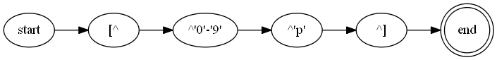

# myrex - MY Regular Expressions in eliXir

An Elixir library for matching strings against regular expressions (REGEX).

The implementation is based on the idea of _Process Oriented Programming:_ 
* Algorithms are implemented using a fine-grain directed graph of 
  independent share-nothing processes.
* Processes communicate asynchronously by passing messages. 
* Process networks naturally run in parallel.

The REGEX is converted to an Abstract Syntax Tree (AST)
using a variation of the _Shunting Yard_ parsing algorithm
\[[Wikipedia](https://en.wikipedia.org/wiki/Shunting_yard_algorithm)\].


The AST is used to build a Non-deterministic Finite Automaton (NFA)
using a variation of _Thomson's Algorithm_
\[[Wikipedia](https://en.wikipedia.org/wiki/Thompson%27s_construction)\].

The NFA is executed directly by propagating messages through the network.

The process network is a directed graph that will contain cycles
to implement quantified repetition.
Quantifiers and alternate choices are implemented
by individual processes of the NFA having 2 or more output edges.
Traversals are duplicated by sending messages 
along _all_ these outgoing edges at once.

All possible traversals are explored in parallel.
Processes implementing rules that do not match the input 
cause the traversal to terminate. A traversal that reaches the 
final process returns a successful match of the input.
A successful match result contains substrings of the input 
captured for groups in the REGEX.

The runtime execution of the process network depends on
the Erlang BEAM scheduler being _fair,_
which means that all active traversals will make some
incremental progress until a successful match is found.
The scheduler will ensure that a single exponentially long
failed match does not starve other traversals.
However, this also means it cannot guarantee the efficient 
dedicated execution of an exponentially long successful match.

Each message contains the traversal state for the match:
* A copy or reference to the input string.
* The current position in the string.
* The current state for groups:
  * Previous capture results.
  * Stack of currently open groups.
* A client process return address for the result.


## Features

A simple regular expression processor.

Standard syntax:
* literal char _c_
* `.` any char
* `|` alternate choice
* `?` zero or one 
* `+` one or  more
* `*` zero or more
* `{` _n_ `}` exactly _n_ repeats
* `(` begin group
* `(?:` begin group without capture
* `)` end  group
* `[`  begin character class
* `[^`  begin negated character class
* `]`  end character class
* `-`  character range
* `\` escape character

Escapes:
* `\C` escape special character _C_
* `\xHH` escape for character value _HH_ with 2 hex digits
* `\uHHHH` escape for Unicode codepoint _HHHH_ with 4 hex digits

Binary Data:
* Strings are processed as binaries
  \[[Erlang](https://www.erlang.org/doc/efficiency_guide/binaryhandling.html)\],
  not converted to character lists.
* Short input strings (< 64B) are copied between processes.
* Large input strings (>=64B) are kept as a single copy,
  with all processes using references into shared heap memory.

Stages of processing:
* Compiling a REGEX into an NFA:
  * Lexical processing of the REGEX to a token sequence.
  * Parsing the tokens into an AST.
  * Traversing the AST to build an NFA process network.
* Matching an input string against an NFA process network.

Two execution patterns:
* Batch - single network that process multiple input strings simultaneously.
* Oneshot - dedicated independent network is built and torn down for each input. 

Two traversal strategies for ambiguous matches:
* One - return the first match and halt execution.
* All - wait for all traversals to complete,
  return all captures for ambiguous matches.
  
Simple public interface in `Myrex` module:
* Batch - `compile` and `teardown`
* Execution - `match` and `search`

Utility to generate diagrams of NFA process networks
in [GraphViz](https://www.graphviz.org) DOT format
and convert them to PNG images.

### Captures

A _group_ in the REGEX is delimited by brackets: `(...)`. 
When an input string is successfully matched, 
the fragment matching the group is stored as a _capture._
The set of all captures is returned as a map of name keys
to capture valules. 

Names are the 1-based integer order 
of the opening `(` in the REGEX. 
The 0-index capture always refers to the whole input string.
In future, explicitly named captures will be supported.

Capture values can be represented in two ways:
* The `{position, length}` reference into the input string.
* The actual substring (binary) matched by the group.

## NFA Design

A process network is a directed graph that has processes for nodes
and message pathways as edges.
A process subgraph has a single input edge and one or more output edges.
The subgraph may be a single process that has both an input and 
one or more outputs.

The NFA is built using a variation of Thompson's Algorithm 
based on process _combinators._
A combinator is a function that takes one or more process subgraphs
and combines them into a single larger graph.
Process combinators correspond to AST branch nodes.
Combinators recursively build larger networks
from smaller operator subgraphs, 
grounded in atomic character matchers
\[[Cox](https://swtch.com/~rsc/regexp/regexp1.html)\].

### Combinators

There are five processes used by combinators
to implement parts of the AST as process subgraphs:
* Branch nodes (quantifiers and alternate choice) 
  use `Split` to clone (fan out) traversals 
  across 2 or more downstream subgraphs.
* Groups use `BeginGroup` and `EndGroup` to record captures.
* Negated character classes use `EndAnd` to 
  advance the input after a sequence of peek matches.
* Leaf nodes use `Match` with an _acceptor_ function
  to do the actual matching of individual characters, 
  character ranges and character classes.
  
#### Sequence and Group

Combinator for a sequence of process networks `P1 P2 .. Pn`:

```
       +----+             +----+
in --->| P1 |---> ... --->| Pn | ---> outputs
       +----+             +----+
```
Combinator for a group capture around a sequence `(P1 P2 .. Pn)`:

```
       +-----+    +----+             +----+    +-----+
in --->|Begin|--->| P1 |---> ... --->| Pn |--->| End |---> out
       |Group|    +----+             +----+    |Group|
       +-----+                                 +-----+
```
  Example for REGEX `"(ab)"`:
  
  .png)
  
  The `BeginGroup` and `EndGroup` are labelled with `(` and `)`.

 Combinator for an AND sequence of peek lookahead 
 matching nodes  `M1 M2 .. Mn`:
 The peeking nodes are created in a negated character class,
 where all tests must pass for the first character of input,
 but the character must not be consumed. 
 At the end of the sequence, when all matches have passed,
 the character must be consumed from input.

  ```
          +--+             +--+    +-----+
   in --->|M1|---> ... --->|Mn|--->| End |---> out
          +--+             +--+    | AND |
                                   +-----+
  ```
  Example for REGEX `[^0-9p]`:
  
  
  
  The `EndAnd` node is labelled with `[^]`.
  
#### Alternate Choice

Combinator for fan-out of alternate matches `P1 | P2 | .. | Pn`
with `Split` process _S_ :

```
                 +----+
                _| P1 |---> outputs
               / +----+
              /
        +---+/   +----+
 in --->| S |--->| P2 |---> outputs
        +---+\   +----+
              \    :   ---> outputs
               \ +----+
                -| Pn |---> outputs
                 +----+
```
  Example for REGEX `a|b|c|d`:
  
  
  
  The `Split` node for alternate choice is labelled with `|`.

Character classes `[...]` are implemented as alternate choices
for all the enclosed characters and character ranges.

  Example for REGEX `[a-dZ]`:
  
  
  
  The `Split` node for a positive character class is labelled with `[]`.
  
Example of a choice between two groups with REGEX `(ab)|(cd)`:
  
  _vbar_(cd).png)

#### Quantifiers

Combinator for _zero or one_ repetitions `P?`.

`Split` node _S_ can bypass the process subgraph _P_ (zero).

```
        +---+
        | P |---> outputs
        +---+
          ^ 
          | 
        +---+
 in --->| S |---> output
        +---+
```

  Example for REGEX `t?`:
  
  

Combinator for _one or more_ repetitions `P+`. 

`Split` node _S_ can cycle back to the process node _P_ (more).
The new network only has one output from the split node.

```
        +---+
 in --->| P |
        +---+
         ^ |
         | V
        +---+
        | S |---> output
        +---+
```
  Example for REGEX `j+`:
  
  
  
Combinator for _zero or more_ repetitions `P*`.

`Split` node _S_ can cycle through the process node _P_ (more).
The split node can bypass the process subgraph _P_ (zero).
The new network only has one output from the split node.

```
        +---+
        | P |
        +---+
         ^ |
         | V
        +---+
 in --->| S |---> output
        +---+
```
  Example for REGEX `m*`:
  
  
  
### Interface Processes
  
There are two process used for the 
overall input and output of the NFA process network:
* `Start` - the initial process where strings are injected for matching.
* `Success` - the final process where successful matches are emitted.

The `Start` process also implements construction of the NFA
by spawning and connecting child processes. 
The child processes are _linked_ to the `Start` process,
so the whole network can be torn down after use, or on error.

The process network has a lifecycle based on _batch_ or _oneshot_ patterns.

### Execution Processes

The matching of individual input strings is managed by a 
transient `Executor` process instance.
An `Executor` is created for each input string, 
and exits when the matching process completes.  

The `Executor` passes the input string to the `Start` process,
monitors the number of active traversals, 
receives notification of failed matches,
and may get a successful match result from the `Success` process.
The `Executor` exits after the result is returned to the calling client.

A _oneshot_ `Executor` builds a private NFA process network,
manages execution for the input string, 
and tears down the network at the end of the match.

A _batch_ `Executor` just re-uses an existing NFA process network
and does not tear the network down at the end.

## Multiple Matches

Some regular expressions are ambiguous and will have multiple matches, 
For example, the string `a` matches the regex `(a?)(a*)` in 2 different ways,
and the resulting captures will have different values: `"a",""` and `"","a"`.

The outcome for ambiguous regexes is usually 
based on whether the operators are _greedy_ or not. 
The Myrex implementation has local atomic operators 
that execute in parallel as an NFA, so they cannot choose 
`greedy` or `non-greedy` behaviour.

However, there is an option to choose how multiple matches are handled:
* _One_ - stop at the first successful match and return the capture.
  If it is a oneshot execution, then teardown the NFA process network.
  If it is a batch execution, then just halt the `Executor` process.
* _All_ - wait for all traversals to complete and return all possible captures.

The _One_ match is non-deterministic - the clue is in the name _*N*_ FA :)
The match is not necessarily the first in order in the input string,
it is just the first successful traversal to complete execution.

The actual outcome depends on the Erlang BEAM scheduler.
If the regular expression is not ambiguous, then the option should be _first,_
because there may be a long delay to wait for all failure traversals to finish.

For example: let the exponential meta-operator `^` mean repetition
of characters and groups in a string.
So `a^4` for a string means `aaaa` 
and `(a?)^4` for a regex means `(a?a?a?a?)`.
We will consider a regex of the form `(a?)^n (a*)^n` 
matching a string of `a^n`
(a highly ambiguous exaggeration from the example in
\[[Cox](https://swtch.com/~rsc/regexp/regexp1.html)\]).

The no. of matches, _S(n),_ is calculated by a 
dot product of two vectors sliced from Pascal's Triangle 
(see the tech note \[[pdf](MultipleMatchRegex.pdf)\] for a proof sketch).

Here are specific examples for `n=3` and `n=4`.

```
M(3) =   [1,3,3,1] * [1,3,6,10]     =   1+9+18+10   =  38

M(4) = [1,4,6,4,1] * [1,4,10,20,35] = 1+16+60+80+35 = 192
```
  
  

Here is the number of traversals _S(n)_ for each value of _n,_
and the elapsed time in seconds (s) for _one_ and _all_ matches
(except for the ~0 timings, which are in microseconds, _us_ ):

```
+------+---+---+----+-----+-------+-------+--------+---------+---------+
|  n   | 1 | 2 |  3 |   4 |     5 |     6 |      7 |       8 |       9 |
| S(n) | 2 | 8 | 38 | 192 | 1,002 | 5,336 | 28,814 | 157,184 | 864,146 |
+------+---+---+----+-----+-------+-------+--------+---------+---------+
| one  |                                  | < 1 us |  < 1 us |   0.015 |
| all  |                                  |  0.250 |   1.485 |   9.625 |
+------+---+---+----+-----+-------+-------+--------+---------+---------+

```
So about 100,000 matches per second when returning all results,
and 15 ms to return the first match while 864k traversals 
are initiated in parallel.

Results are for Windows running on Intel i7-8550U @ 1.80GHz,
with 4 hardware cores and 8 hardware threads. 
The Erlang shell displays:
```
Erlang/OTP 23 [erts-11.1] [source] [64-bit] [smp:8:8] [ds:8:8:10] [async-threads:1]
```

### Pattern Modes

There are two ways the REGEX can be applied to the input: 
* `match` - an exact match of the REGEX with the whole input string.
* `search` - find a partial match of the REGEX somewhere within the input string.

The `Myrex` top-level module has separate interface 
functions for _match()_ and _search()._

The mode applies to both batch and oneshot network lifecycles. 
The default behaviour of an NFA is _match_ mode. 

For a oneshot _search,_ the REGEX is just wrapped 
with a `'.*'` prefix and suffix, then an NFA is created
for the new expression.

A batch _search_ is more difficult, because the existing NFA
cannot be modified (it may be running concurrent match traversals).
A _search_ `Executor` builds a `'.*'` 
prefix subgraph and connects the output to the `Start` node of the main NFA.
The `Executor` then listens for partial match messages 
from the existing `Success` node, and redirects the results
as new traversals of the augmented NFA network. 
The search `Executor` tears down the transient prefix subgraph
at the end of execution, but the main NFA is not changed.

### Graph Output

The NFA can be dumped to [GraphViz](https://www.graphviz.org) 
DOT format \[[pdf](https://www.graphviz.org/pdf/dotguide.pdf)\], 
and optionally generate PNG images if you have GraphViz installed.

The test suite will write graphs for all compiled REGEXes.
DOT and PNG files are written to the `dot` subdirectory by default.

The images of NFAs in this README were auto-generated from tests. 

## Usage

### Public Interface

The main public interface is in the `Myrex` top-level module.

Oneshot execution:
```
{:match, _}    = Myrex.match("(ab)|(cd)", "ab")
{:mo_match, _} = Myrex.match("(ab)|(cd)", "XY")

{:search, {2,2}, _} = Myrex.search("(ab)|(cd)", "XYabZ")
```

Batch execution:
```
nfa = Myrex.compile("(ab)|(cd)")

  {:match, _}    = Myrex.match(nfa, "cd")
  {:no_match, _} = Myrex.match(nfa, "XY")

  {:search, {2,2}, _} = Myrex.search(nfa, "XYabZ")
  
  {:searches, [{{3,2}, _}, {8,2}, _}] } =
      Myrex.search(nfa, "PQRabSTUcdVW", [multiple: :all])

:teardown = Myrex.teardown(nfa)

```

### Options

Options are passed as `Keyword` pairs.

The currently supported keys and values are:

`:capture` the values to return in match results:
* `:all` (default) - all captures are returned, 
  except those explicitly excluded using `(?:...)` anonymous group syntax.
* _names_ - a list of names (1-based integers) to return a capture value.
* `:none` - no captures are returned, except the key `0` for the whole string.

`:return` the type for group capture results:
* `:index` (default) - the raw `{ position, length }` reference into the input string.
* `:binary` - the actual substring of the capture.

`:dotall` (boolean, default `false`) - 
  force the _any character_ wildcard `.` to include newline `\n`.
  
`:timeout` (integer, default 1000ms) - the timeout (ms) for executing a string match.

`:multiple` decide behviour when the regular expression is ambiguous:
* `:one` (default) - stop at the first successful match, return the capture.
  If it is a oneshot execution, then teardown the NFA process network.
  If it is a batch execution, then just halt the `Executor` process.
* `:all` - wait for all traversals to complete and return all possible captures.

`:graph_name` - a flag or filename for DOT and PNG graph diagram output:
* `nil` (default) - no graph output.
* `:re` - use the REGEX as the filename, with suitable escaping and truncation.
* _filename_ (string) - the filename to use.
  
### Examples

`TODO`

## Performance

`TODO`

## Project 

Compile the project:

`mix deps.get`

`mix compile`

Run dialyzer for type analysis:

`mix dialyzer`

Run the tests:

`mix test`

Generate the documentation:

`mix docs`

## License

This software is released under the permissive open source [MIT License](LICENSE.txt).

The code and documentation are Copyright © 2022 Mike French

